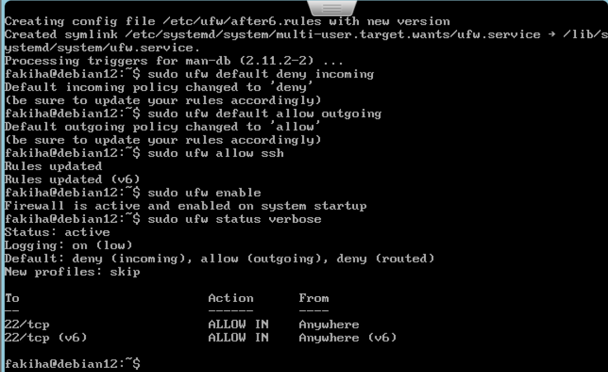
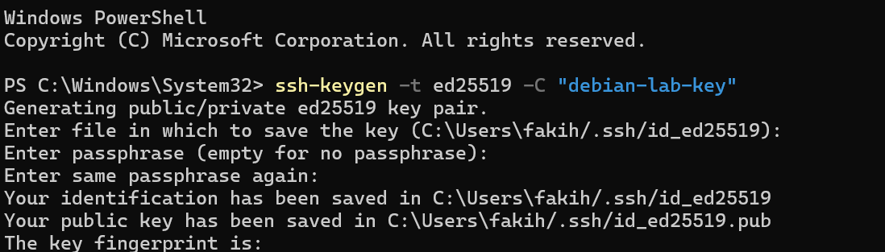
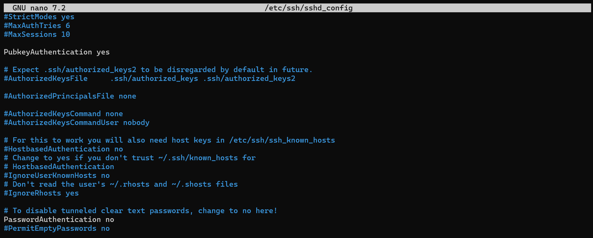

# Phase 1: Host Hardening \& Zero-Trust Access Control


## Overview
Phase 1 focuses on reducing the attack surface of the Debian 12 host by enforcing network-level filtering with Uncomplicated Firewall (UFW) and establishing cryptographically secure remote access via SSH key authentication.


---


## Tools & Technologies
* **Operating System:** Debian 12 (Bookworm)
* **Firewall Engine:** Uncomplicated Firewall (`ufw`)
* **Remote Access & Protocol:** OpenSSH Server (`sshd`)
* **Cryptographic Keys:** `Ed25519` Asymmetric Key Pair
* **CLI Utilities:** `ssh-keygen`, `chmod`, `systemctl`


## Implementation Steps

### 1. Network Firewall Baseline (UFW)
Configured a default-deny posture for incoming traffic while explicitly allowing SSH remote management.

```bash

# Set default policies
sudo ufw default deny incoming
sudo ufw default allow outgoing

# Configure custom SSH port rule
sudo ufw allow ssh

# Enable firewall
sudo ufw enable
sudo ufw status verbose
```

### 2. Cryptographic SSH Hardening
Replaced standard password-based access with asymmetric key authentication (Ed25519).

#### Generated SSH Key Pair on administrator host
```text
ssh-keygen -t ed25519
```

##### Enforced strict file permissions:
```text
.ssh directory: 700 (drwx------)
authorized\_keys: 600 (-rw-------)
```

### 3. Secure SSH Daemon Configuration (ssh\_config)
Modified /etc/ssg/sshd\_config to not allow password or root logins.

```text
PermitRootLogin no
PasswordAuthentication no
PubkeyAuthentication yes
```

## Engineering Notes & Troubleshooting
Service Runtime Directories: Resolved SSH service startup failures (crashed due to errors in sshd\_config file) by ensuring /run/sshd permissions matched standard Debian privilege requirements before correctly editing the file.

## Phase Results & Verification
Verify UFW is up and running


Creation of SSH key through ed25519 encryption


File changed in sshd_config


## Next Steps
Proceed to Phase 2: Kernel-Level Event Auditing (auditd) to configure low-level system call telemetry and custom watch rules.

