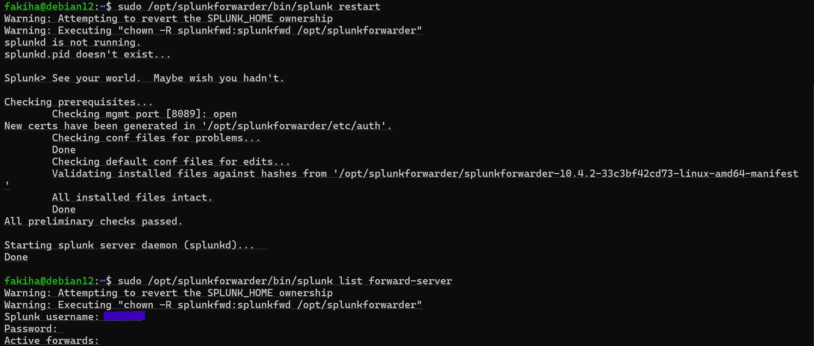
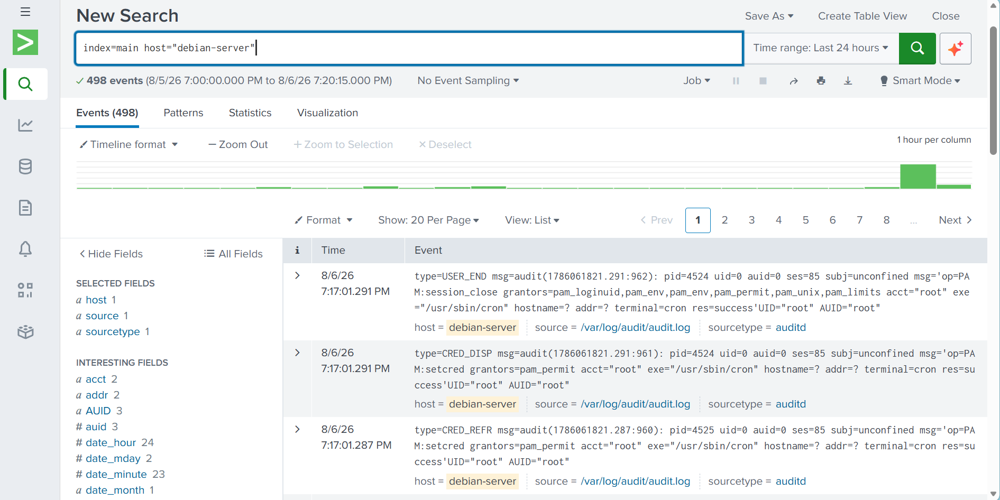

# Phase 3: Centralized SIEM Ingestion & Log Pipeline


## Overview
Phase 3 establishes an agent-based log forwarder pipeline using the Splunk Universal Forwarder to transmit host system and audit logs over TCP port `9997` to the central Splunk indexer.


---


## Tools & Technologies
* **Forwarding Agent:** Splunk Universal Forwarder (`splunkforwarder`)
* **SIEM Target:** Splunk Enterprise Indexer
* **Syslog Engine:** `rsyslog`
* **Target Log Files:** `/var/log/auth.log`, `/var/log/audit/audit.log`
* **Network & Ingestion Ports:** TCP Port `9997`
* **Configuration Files:** `inputs.conf`

## Technical Implementation

### 1. Syslog Service Restoration (`rsyslog`)
Debian 12 defaults strictly to `systemd-journald`. Installed `rsyslog` to populate continuous plain-text authentication logs at `/var/log/auth.log`.

```bash
sudo apt update && sudo apt install rsyslog -y
sudo systemctl enable --now rsyslog
```

### 2. Universal Forwarder & Inputs Configuration
Installed the Splunk Universal Forwarder package and configured /opt/splunkforwarder/etc/system/local/inputs.conf to target key log sources.

```text
[default]
host = debian-server

[monitor:///var/log/auth.log]
disabled = false
sourcetype = syslog
index = main

[monitor:///var/log/audit/audit.log]
disabled = false
sourcetype = auditd
index = main
```

### 3. Log Forwarding & Connection Setup
Configured world-read permissions on targeted log files and established the central receiver connection.

```bash
# Grant read permissions to log files
sudo chmod 755 /var/log
sudo chmod 644 /var/log/auth.log
sudo chmod o+r /var/log/audit/audit.log

# Connect to Splunk Receiver
sudo /opt/splunkforwarder/bin/splunk add forward-server <SPLUNK_RECEIVER_IP>:9997
```

#### Connection Status Verification:
### 4. Indexer Ingestion Verification
Verified raw log ingestion in the Splunk Search interface for both sourcetype=syslog and sourcetype=auditd.

## Engineering Notes & Troubleshooting
Systemd Service Naming: Splunk forwarder generates systemd integration under the service name SplunkForwarder.service (rather than splunkd). Service status verified via systemctl status SplunkForwarder.

## Phase Results & Verification
Splunk forwarder shows logs are being actively forwarded


Displays the log events being successfully aggregating logs


## Next Steps
Proceed to Phase 4: Threat Detection, Alerting & SOC Dashboarding to build custom SPL queries and assemble the real-time SOC dashboard.
