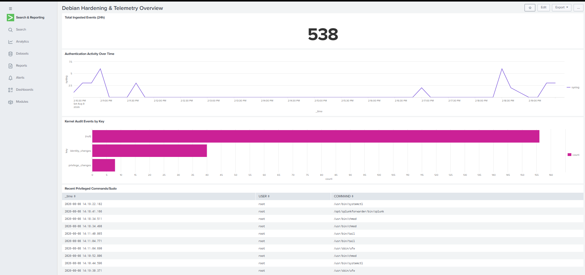

# Phase 4: Threat Detection, Alerting & SOC Dashboarding


## Overview
Phase 4 translates ingested host logs into actionable SOC analytics through custom Splunk Processing Language (SPL) queries and a real-time monitoring dashboard.


---


## Tools & Technologies
* **SIEM Platform:** Splunk Enterprise Web Interface
* **Query Language:** Splunk Processing Language (SPL)
* **Visualization Components:** Single-Value Panels, Line Charts, Categorical Bar Charts, Data Tables
* **Attack Simulation Tools:** OpenSSH CLI, `sudo`, Bash Scripting
* **Framework Alignment:** MITRE ATT&CK (Brute Force, Valid Accounts, Privilege Escalation)

## Threat Detections (SPL)

### 1. SSH Brute Force Detection

```spl
index=main host="debian12" source="/var/log/auth.log" "Failed password"
| stats count by src_ip, user
| where count >= 5
```

### 2. File Integrity & Identity Escalation

```spl
index=main host="debian-server" sourcetype="auditd" (key="privilege_changes" OR key="identity_changes")
| table _time, host, AUID, exe, res
```

### 3. Unauthorized Account Creation

```spl
index=main host="debian-server" sourcetype="auditd" key="identity_changes" (type=ADD_USER OR "useradd") 
| table _time, host, AUID, exe, success
```

## SOC Dashboard Architecture
Built a real-time dashboard featuring key panels:
1. Total Ingested Events (24h): Single-value metrics panel.

```spl
index=main host="debian-server" 
| stats count
```

2. Authentication Activity Timeline: Line chart tracking authentication events over time.

```spl
index=main host="debian12" source="/var/log/auth.log" 
| timechart count by sourcetype
```

3. Kernel Audit Events by Key: Categorical distribution of identity_changes vs privilege_changes.

```spl
index=main host="debian-server" sourcetype="auditd" 
| stats count by key
```

4. Recent Privileged Commands: Interactive tabular view of sudo execution history.

```spl
index=main host="debian12" source="/var/log/auth.log" "COMMAND=" 
| table _time, user, COMMAND
```

## Attack Simulation & Verification Exercises
### Exercise 1: Brute-Force Simulation
Executed invalid login sequences to trigger auth.log failed password events

```bash
ssh fakeuser@<DEBIAN_IP>
```

### Exercise 2: Privileges File Integrity Trigger
Triggered kernel watch rules by editing watched privilege directories

```bash
sudo touch /etc/sudoers.d/test_rule
sudo ufw status
sudo rm /etc/sudoers.d/test_rule
```

### Exercise 3: Generate System Activity & Authentication Events
Generated a mix of successful/failed logins and rule triggers

```bash
#Successful SSH login
ssh user@<DEBIAN_IP>

#Switch between root and test session
sudo -i
exit

#Restart auditd to generate system service event keys
sudo service auditd restart
```

## Phase Results & Verification

